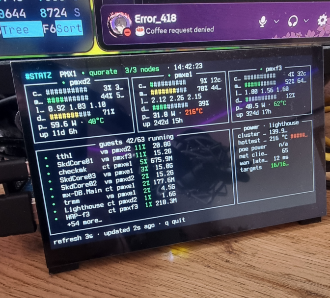

<h1 align="center">▍STATZ</h1>

<p align="center">
  <em>a minimal TUI status board for your Proxmox cluster — born to live on a small always-on display</em>
</p>

<p align="center">
  
</p>

<p align="center">
  <sub>statz on a Banana Pi M5 · 3-node Proxmox cluster · live watts &amp; temps via VictoriaMetrics</sub>
</p>

---

## what it shows

- **cluster header** — name, quorum, nodes online, clock
- **per node** — cpu / mem / disk bars, load, uptime, and live **power draw (W) + cpu temp** overlays
- **guests** — all VMs & containers, running-first, sorted by cpu, colored by state
- **metrics panel** — anything you can express in PromQL: cluster watts, temps, PoE power, UPS stats, scrape-target health

One Python file. Two dependencies ([rich](https://github.com/Textualize/rich), [httpx](https://github.com/encode/httpx)). Reads the Proxmox API with a **read-only token** and any Prometheus-compatible endpoint — directly or through Grafana's datasource proxy.

## quickstart

```sh
git clone https://github.com/YOURUSER/statz && cd statz
python3 -m venv .venv && .venv/bin/pip install -r requirements.txt
cp statz.example.toml statz.toml   # fill in your endpoints + token
.venv/bin/python statz.py
```

`q` quits. That's the whole manual.

### a read-only Proxmox token (do this instead of using your root password)

```sh
pveum user token add root@pam statz --privsep 1
pveum acl modify / --tokens 'root@pam!statz' --roles PVEAuditor
```

The token can see everything and touch nothing.

### finding your metric names

```sh
.venv/bin/python statz.py --discover watt     # or ups, temp, power, ...
```

lists every matching metric name your Prometheus actually exposes, so the
`[[metrics.stat]]` queries in `statz.toml` are a copy-paste job.

## run it on a wall display

statz is happiest on the raw console of a small SBC (it was built on a Banana Pi M5).
Systemd unit that takes over tty1 on boot:

```ini
# /etc/systemd/system/statz.service
[Unit]
Description=statz status board
After=network-online.target
Wants=network-online.target
Conflicts=getty@tty1.service

[Service]
WorkingDirectory=/root/statz
ExecStart=/root/statz/.venv/bin/python statz.py
Restart=always
RestartSec=5
TTYPath=/dev/tty1
StandardInput=tty
StandardOutput=tty
Environment=TERM=linux

[Install]
WantedBy=multi-user.target
```

```sh
systemctl disable getty@tty1 && systemctl enable --now statz
```

Tiny text on a high-DPI panel? Pick a bigger console font:
`setfont /usr/share/consolefonts/Uni2-TerminusBold32x16.psf.gz`

## config

Everything lives in `statz.toml` — see [`statz.example.toml`](statz.example.toml) for
all options: Proxmox auth (token or password), one or **two** metric datasources
(per-stat `url` override), per-node power/temp overlay queries, units, precisions,
and bar scales.

## license

MIT
